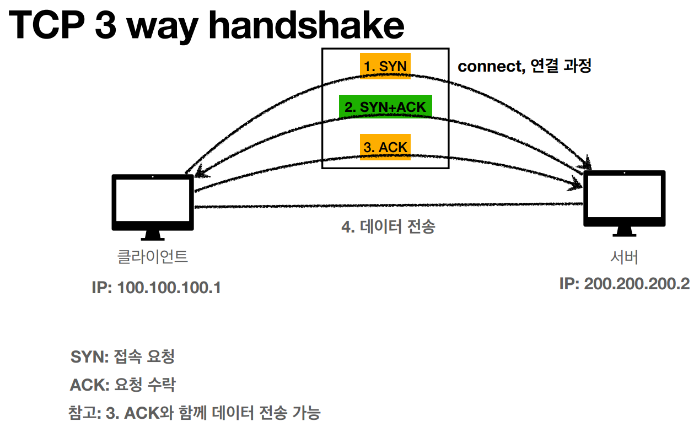

### 인터넷 네트워크

# TCP
### 전송 지향 프로토콜(Transmission Control Protocol)

- 연결지향 -TCP 3 way handshake (가상 연결)
- 데이터 전달 보증
- 순서 보장
- 신뢰할 수 있는 프로토콜
- 현재는 대부분 TCP 사용

# UDP
### 사용자 데이터그램 프로토콜(User Datagram Protocol)
- 하얀 도화지와 같음(기능이 거의 없음)
- 데이터 전달 보장 X
- 순서 보장 X
- 데이터 전달 및 순서가 보장되지 않지만, 단순하고 빠름
- 요약
    - IP(Internet Protocol)과 거의 같음. Port, Checksum 정도 추가
    - 어플리케이션에서 추가 작업이 필요함
    
# PORT
- 동일한 IP 내에서 프로세스를 구분하기 위한 구분자
- 0 ~ 65535 할당 가능
- 0 ~ 1023 : 잘 알려진 포트, 사용하지 않는 것이 좋음 

# DNS
### 도메인 네임 서버(Domain Name Server)
- 도메인명을 IP로 변환 
